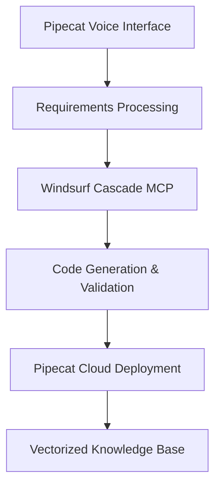

# 🤖 Pipecat Agent Builder

Build sophisticated voice AI agents through **natural conversation** - now with a real Pipecat voice interface!

## 🎤 **NEW: Voice Interface**

Talk directly to build your agents! Just like the Pipecat quickstart examples, you can now:
- **Click the microphone** and describe your agent naturally
- **Real-time conversation** with voice visualization  
- **WebSocket connection** for instant responses
- **Fallback to forms** if voice isn't available

## ✨ **Key Features**

- 🎤 **Voice Interface** - Talk naturally to build agents (NEW!)
- 🎯 **Natural Language Input** - Describe your agent in plain English
- 🔧 **Complete Code Generation** - Get full Pipecat applications, not just snippets  
- 📞 **Multi-Channel Support** - Phone, web, mobile integrations
- 🌍 **Multi-Language** - Support for multiple languages
- ☁️ **Ready to Deploy** - Includes Railway/cloud deployment configs
- 📚 **Knowledge Integration** - Upload documents for agent training
- 🎨 **Customizable Personalities** - Define agent behavior and tone

## Architecture



## 🏃‍♂️ **Quick Start**

### **Option 1: Use Deployed Version**
Visit the live app: [Your Railway URL]
- Click the microphone and start talking!
- Or use the form builder as backup

### **Option 2: Run Locally**

**Backend (Python):**
```bash
# Clone the repository
git clone <your-repo-url>
cd pipecat-agent-builder

# Install Python dependencies  
pip install -r requirements-railway.txt

# Set up environment variables
cp .env.example .env
# Add your API keys to .env

# Start the server
python web_app.py
```

**Frontend (React + Pipecat):**
```bash
# In a new terminal
cd client

# Install Node.js dependencies
npm install

# Start the React dev server  
npm run dev
```

Visit http://localhost:5173 for the full voice interface!

## Components

- `core/` - Core system components
- `knowledge/` - Documentation vectorization and search
- `generation/` - Code generation templates and logic
- `deployment/` - Pipecat Cloud deployment automation
- `interface/` - Conversational interface components
- `mcp/` - Windsurf Cascade MCP integration

## 🔑 **Required API Keys**

Add these to your `.env` file or Railway environment variables:

```bash
OPENAI_API_KEY=sk-proj-your-openai-key
DEEPGRAM_API_KEY=your-deepgram-key  
CARTESIA_API_KEY=your-cartesia-key
```

## 🎯 **How It Works**

### **Voice Mode (Recommended)**

1. **Click the microphone** - Start a voice conversation
2. **Describe your agent** - "I need a sales bot for my SaaS company"
3. **Natural follow-up** - AI asks about channels, features, personality
4. **Code generation** - Creates complete Pipecat application
5. **Download & deploy** - Get ZIP with all files ready for production

### **Form Mode (Fallback)**

1. **Fill out the form** - Structured input for agent requirements
2. **Submit details** - Specify channels, languages, use case
3. **Generate agent** - AI creates the complete application
4. **Download files** - Get your production-ready agent

## 📚 **Example Voice Prompts**

### Customer Service Bot
*"Create a customer service agent for my e-commerce store that can track orders, handle returns, answer product questions, and escalate to humans when needed. I need it to support both English and Spanish."*

### Restaurant Assistant  
*"Build a phone agent for my Italian restaurant that takes reservations, answers menu questions, handles takeout orders, and provides directions. It should have a warm, friendly personality."*

### Sales Assistant
*"I need a sales bot for my SaaS company that can qualify leads, schedule demos, answer pricing questions, and integrate with our CRM. It should sound professional but approachable."*

## License

MIT License - see LICENSE file for details.
