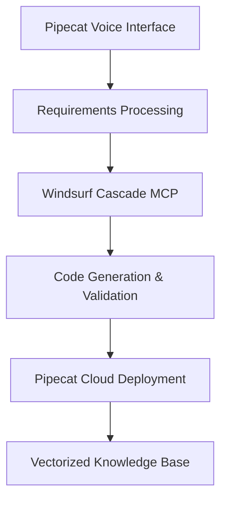

# Pipecat Agent Builder

An LLM-powered conversational interface for building and deploying Pipecat AI agents through natural language interaction.

## Features

- 🗣️ **Conversational Interface**: Use Pipecat's own voice SDK to describe your agent requirements
- 🤖 **Windsurf Cascade Integration**: Leverage MCP for expert code generation and validation
- 📚 **Vectorized Knowledge Base**: Access the entire Pipecat documentation for optimal patterns
- 🚀 **Automated Deployment**: Deploy directly to Pipecat Cloud with zero configuration
- 🔧 **Knowledge Integration**: Scrape and integrate external knowledge sources

## Architecture



## Quick Start

1. **Install Dependencies**

   ```bash
   pip install -r requirements.txt
   ```

2. **Set up Environment**

   ```bash
   cp .env.example .env
   # Add your API keys
   ```

3. **Initialize Knowledge Base**

   ```bash
   python scripts/vectorize_docs.py
   ```

4. **Start the Builder**

   ```bash
   python main.py
   ```

## Components

- `core/` - Core system components
- `knowledge/` - Documentation vectorization and search
- `generation/` - Code generation templates and logic
- `deployment/` - Pipecat Cloud deployment automation
- `interface/` - Conversational interface components
- `mcp/` - Windsurf Cascade MCP integration

## Usage

Simply start a conversation with the agent builder:

> "I want to create a customer service bot that can handle phone calls in Spanish and English, access our FAQ database, and integrate with Zendesk."

The system will:

1. Gather detailed requirements through conversation
2. Generate optimized Pipecat code using Windsurf Cascade
3. Set up knowledge base integration
4. Deploy to Pipecat Cloud
5. Provide management dashboard and monitoring

## License

MIT License - see LICENSE file for details.
